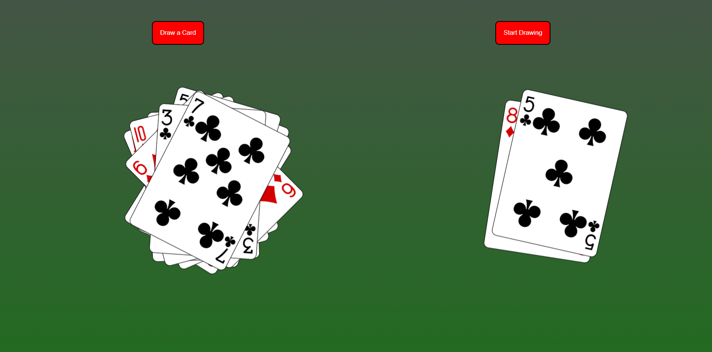

# React Effects And Refs Exercise: Card Drawer



## Description: 

You can either draw a card with a click of a button until you reach the end of the deck, or click another button to draw a card contiuously every second until you toggle it 
to stop. This application was made with the [Deck of Cards API](https://deckofcardsapi.com/) and made possible with React's useState, useEffect, and useRef. 

## Tools used: 

* React.js
* Axios 

## Setup & Running

Created with [Create React App](https://create-react-app.dev/).

1. Clone this repository

2. Use the NPM scripts

   - Install the dependencies 

     ```bash
     npm i 
     ```

   - Running in development mode

     ```bash
     npm run start
     ```

   - Create production build

     ```bash
     npm run build
     ```
